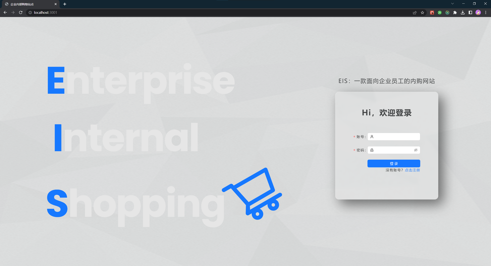
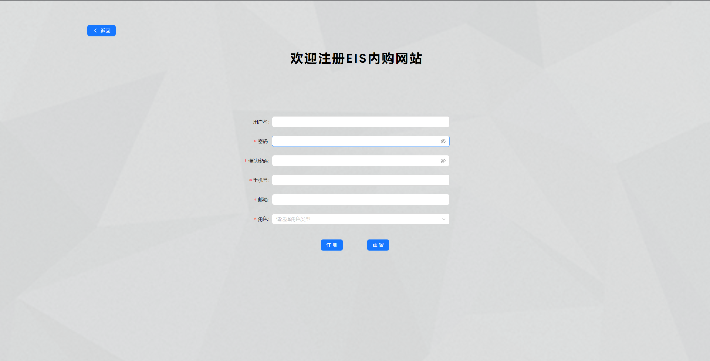
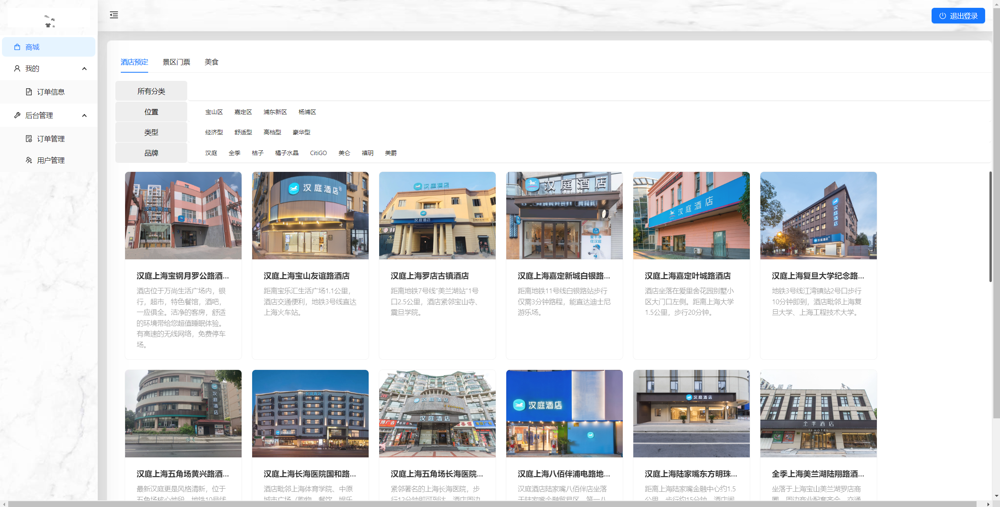
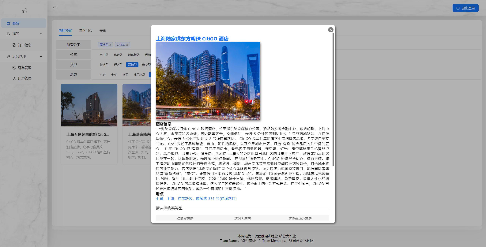
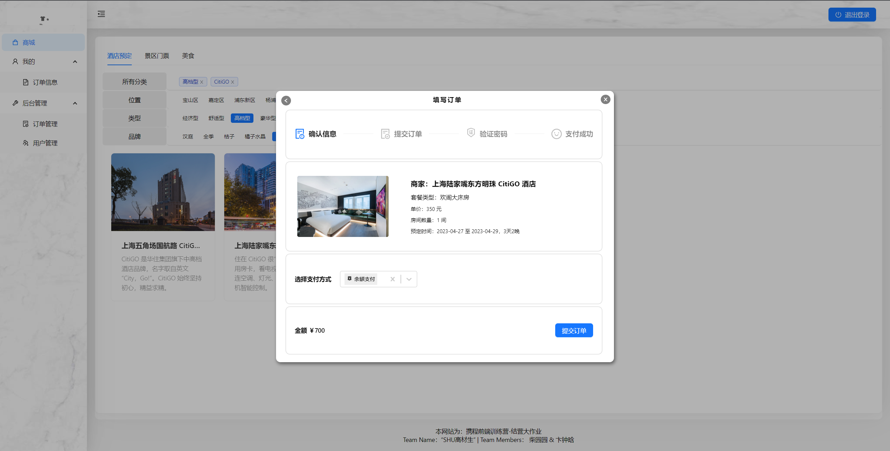
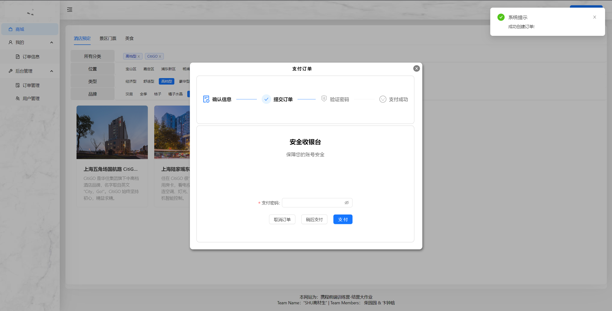
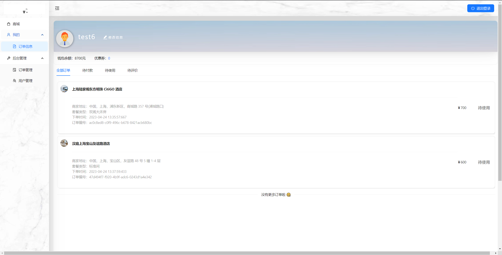
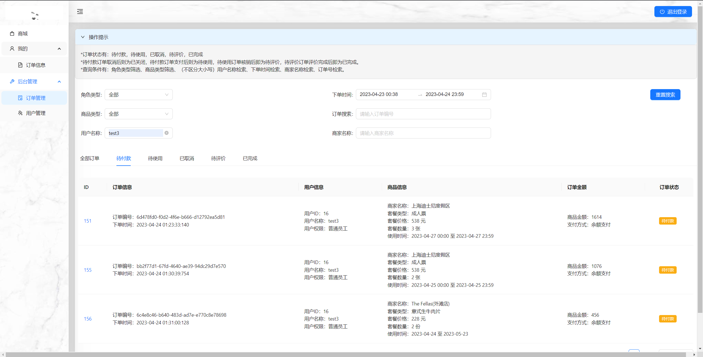
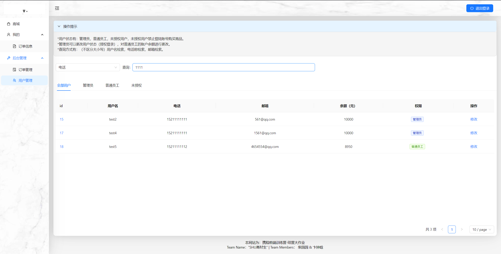

# 携程前端训练营结营大作业-[题目4]企业内购的一套购物站点

## 项目描述

为了满足企业员工的购买需求，需要开发一套用于内部员工使用的购物站点。角色主要有普通员工、管理员和未授权角色。普通员工登陆后可进行在线购物，购买路径为，列表页->详情页->下单页->支付页，还可以在“我的-订单信息“查看订单信息。管理员角色登陆后可以进行正常购物和查看个人订单信息，此外还可以看到用户管理和订单管理页面。在用户管理页面，管理员可以控制用户访问此系统的权限。订单管理页面则可以看到所有的下单列表。

# Preview











# Installation
## Quick Start
1. install [Node.js](https://nodejs.org/en)
2. clone code
```
$ git clone --recursive https://github.com/ChaiYuanYuan-bit/site-react.git
```
3. install site-react packages
```
$ cd site-react
$ npm i
```
4. install site-server packages
```
$ cd site-server
$ npm i
```
5. run site-server
```
$ npm start
```
6. run site-react
```
$ cd..
$ npm start
```
## Login Account
账户：admin
密码：123321