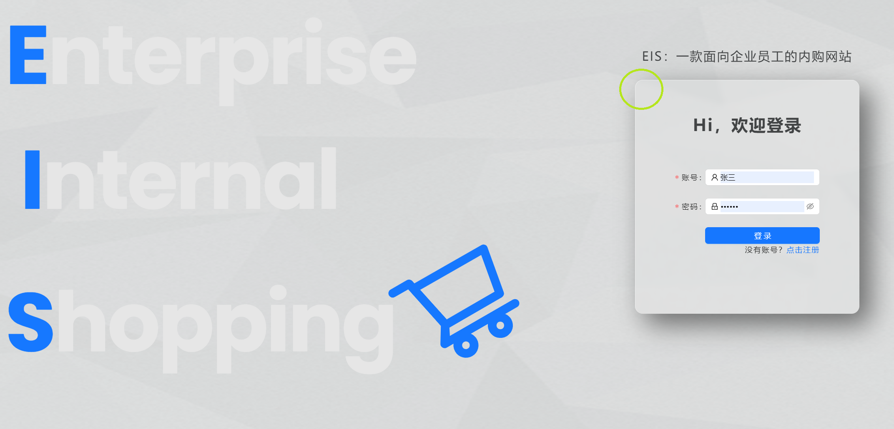
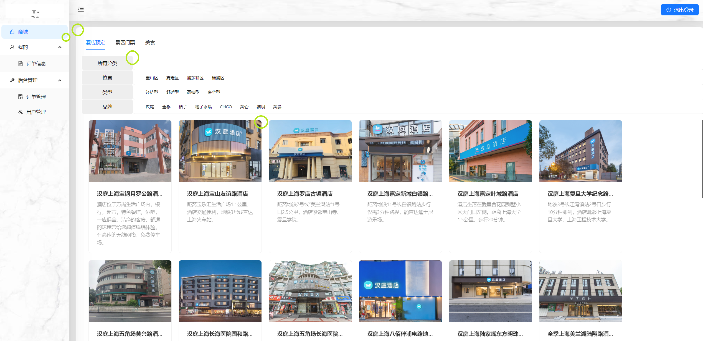
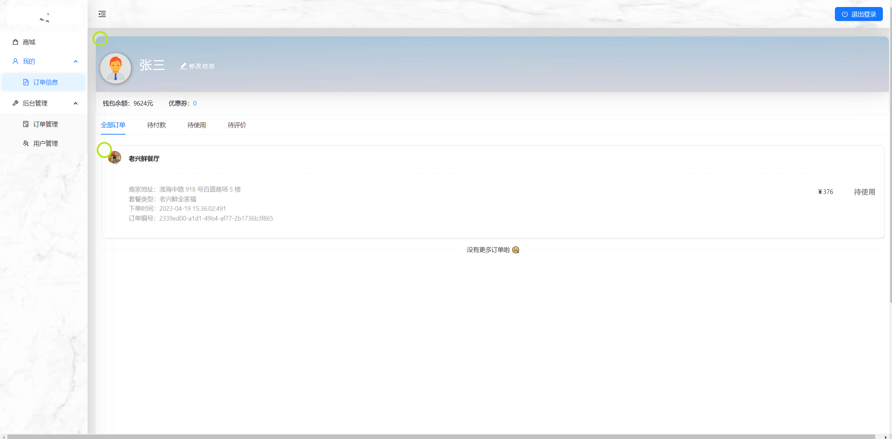
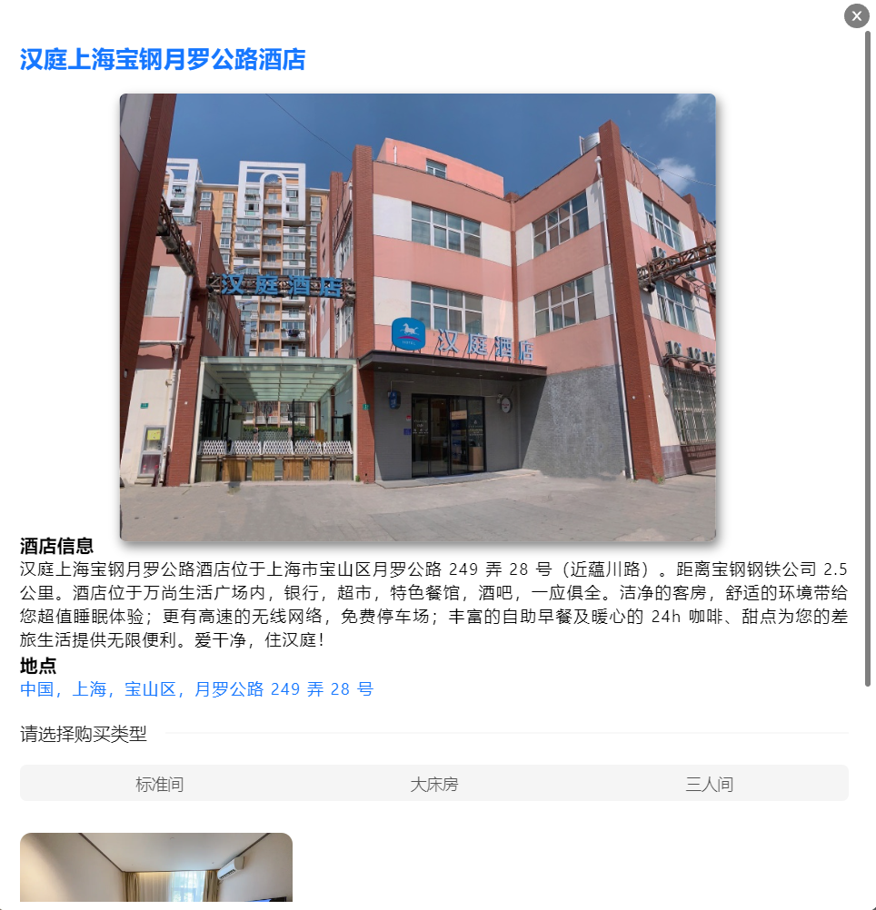
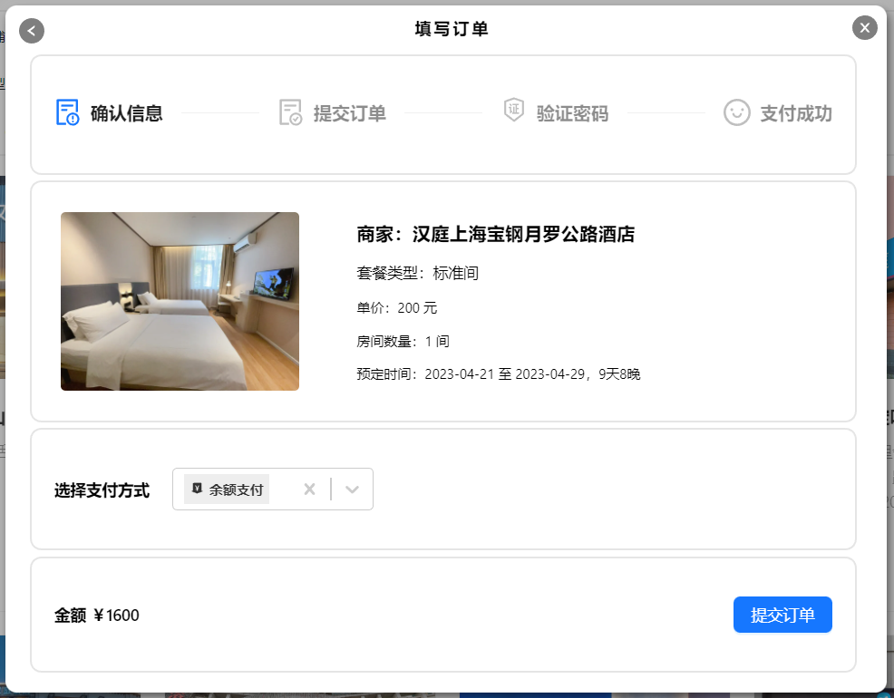
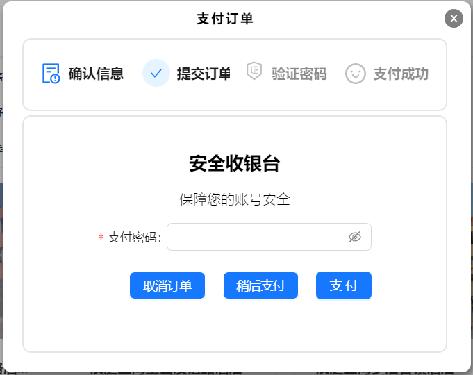
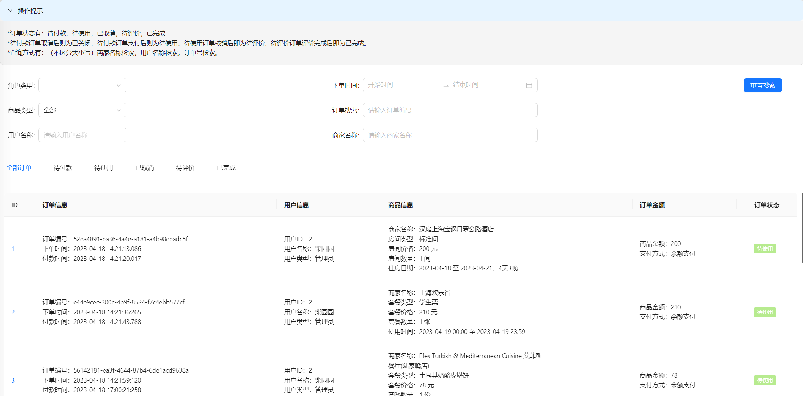
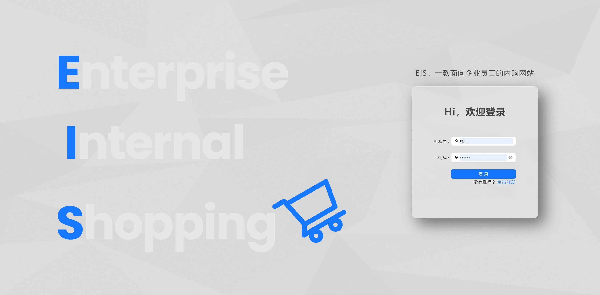
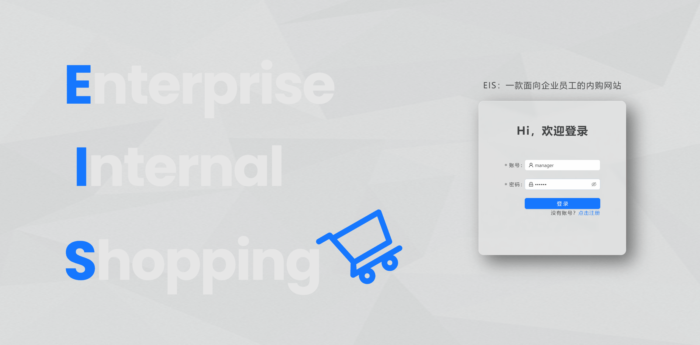

# 携程前端训练营大作业结业项目汇报文档

## 一、项目介绍

###  项目概要信息

**项目名称**：企业内购的一套购物站点
**项目描述**：为了满足企业员工的购买需求，开发一套用于内部员工使用的购物站点。角色主要有用户角色和管理员角色。用户角色登陆后可进行在线购物，购买路径为，列表页->详情页->下单页->支付页 还有一个“我的“可以查看订单。管理员角色登陆后可以看到用户管理和订单管理页面。在用户管理页面，管理员可以控制用户访问此系统的权限。订单管理页面则可以看到所有的下单列表。

### 项目地址

React 前端地址：https://github.com/ChaiYuanYuan-bit/site-react
Node 后端地址：https://github.com/ChaiYuanYuan-bit/site-server

初始管理员账号密码：
```
账户名：admin
密码：123321
```

## 二、项目分工

## 三、 项目实现

### 3.1 前端部分

#### 3.1.1 技术选型

|技术|说明|相关开发文档|
|:-----|:-----|:-------|
|React|构建用户界面的 JavaScaripte 库|https://react.docschina.org/reference/react|
|Router6|完整的 React 路由解决方案|https://baimingxuan.github.io/react-router6-doc/|
|Redux Toolkit|高效的 Redux 开发工具集|https://cn.redux.js.org/redux-toolkit/overview/|
|Redux-Persist |实现状态持久化存储(解决页面刷新导致状态丢失的问题)|https://redux-toolkit.js.org/rtk-query/usage/persistence-and-rehydration|
|Axios|基于 Promise 封装 Ajax|https://www.axios-http.cn/|
|CryptoJS|JavaScript 的加解密工具包|https://code.google.com/archive/p/crypto-js/|
|scss|CSS 预处理|https://www.sass.hk/|
|Ant-design|支持 React 的 UI 组件库|https://ant.design/components/overview-cn/|
|React-Select|高度可定制的 select 库|https://react-select.com/home|
|Ant-design/icons|Ant-design 图标库|https://ant.design/|
|React-icons|React 图标库|https://react-icons.github.io/react-icons/search|
|Pexels|免费素材图片和视频|https://www.pexels.com/zh-cn/|

####   3.1.2 架构设计

##### （1）页面设计

项目的主要页面在 [ src/views](https://github.com/ChaiYuanYuan-bit/site-react/tree/main/src/views) 中，详细页面如下：
|页面名称|项目中对应文件|
|:----|:----|
|用户登录页面|Login|
|用户注册页面|Register|
|主页面|Layout|
|商城页面|Mall|
|商品详情页面|Detail|
|商品下单页面|Buy|
|商品支付页面|Pay|
|我的-订单信息页面|Mine|
|管理员-订单管理页面|OrderManage|
|管理员-用户管理页面|UserManage|

##### （2）组件化设计

项目主要在系统通知提醒、商城页面、商品详情页面、商品下单页面以及商品支付页面使用了组件化的设计。组件部分的代码在 [src/components](https://github.com/ChaiYuanYuan-bit/site-react/tree/main/src/components) 中。
-	系统通知提醒 - GlobalNotification：封装了 Ant-design 的 Notification 通知提醒框，并配合Redux实现全局系统通知提醒。
-	商城页面 - CardGroup：封装了Ant-design 的 Card 组件，并使用scss完成商品展示区的flex布局，最终实现了整个商品展示区。
-	商城页面 - NavGroup：封装了Ant-design 的 Tag、CheckableTag 组件，联动了全部分类和子分类的 Tag 展示，最终实现了商城的商品导航组件。
-	商品详情页面 - MarkDown：封装了 react-markdown 组件，在其基础上添加了src属性，配合 axios 的 get 方法，使其像 img 标签一样好用。
-	商品详情页、下单页和支付页共同使用 - MaskLayout：使用 scss 设计了蒙版效果的页面，并且蒙版展示时，可以固定视口，禁止下层页面滚动。

##### （3）状态集中管理

相比于redux-router-dom，使用 Redux-Toolkit 不再像原来一样要写容器组件和纯函数那样复杂，而是直接使用createSlice、configureStore、useSelector和useDispatch等方法实现更灵活的状态管理。在本项目中，使用了 Redux-Toolkit 保存用户非敏感信息以及全局通知提醒状态，并配合 Redux-Persist  解决页面刷新时状态丢失的问题。redux部分的代码在 [src/redux](https://github.com/ChaiYuanYuan-bit/site-react/tree/main/src/redux) 中。

##### （4）路由管理

相对于 Router5 ，Router6可以使用 useRoutes 、路由表（routes）和 Outlet 实现了整个系统的路由注册和路由页面展示，使路由管理更方便。此外，使用Router6的 Navigate、 useSearchParams 和 useLocation 等hooks可以实现更方便的路由跳转和传参。路由部分的代码在 [src/utils](https://github.com/ChaiYuanYuan-bit/site-react/tree/main/src/utils) 中，路由表如下。

```javascript
const routes = (props)=>[
{
    path:'/home',
    element:<Layout {...props}/>,
    children:[
        {
            path:'mall',
	        element:<Mall {...props}/>,
            children:[
                {
                    path:'detail',
	                element:<Detail {...props}/>,
                },
                {
                    path:'buy',
	                element:<Buy {...props}/>,
                },
                {
                    path:'pay',
                    element:<Pay {...props}/>
                }
            ]
        },
        {
            path:'mine',
            element:<Mine {...props}/>,     
            children:[
                {
                    path:'pay',
                    element:<Pay {...props}/>
                }
            ]
        },
        {
            path:'orders',
            element:<OrderManage {...props}/>
        },
        {
            path:'users',
            element:<UserManage {...props}/>
        }
    ]
    },
    {
        path:'/register',
        element:<Register {...props}/>
    },
    {
        path:'/',
        element:<Login {...props}/>
    },
    {
        path:'*',
        element:<NotFound {...props}/>
    }
]
}
```

##### （5）Axios
- Axios 部分的代码在 [src/utils/request](https://github.com/ChaiYuanYuan-bit/site-react/blob/main/src/utils/request.js)中，封装了axios相关配置，例如baseURL、请求拦截器、响应拦截器等。

- API 部分的代码在 [src/api](https://github.com/ChaiYuanYuan-bit/site-react/tree/main/src/api) 中，封装了前端与后端通信的全部接口。

#### 3.1.3 项目文件结构
- api
	-	detail.js
	-	mall.js
	-	orders.js
	-	pay.js
	-	roleApi.js
	-	userApi.js
- components
	-	CardGroup
		-	CardGroup.scss
		-	index.jsx
	-	GlobalNotification
		-	index.jsx
	-	MarkDown
		-	MarkDown.scss
		-	index.jsx
	-	MaskLayout
		-	MarkDown.scss
		-	index.jsx
	-	NavGroup
		-	NavGroup.scss
		-	index.jsx
- config
	-	index.js
- redux
	-	Notification
	-	UserInfo
	-	index.js
- routes
	-	index.js
- utils
	- 	emptyRender.js
	- 	encrypt.js
	- 	request.js
- views
	- 	Layout
		-	Layout.scss
		-	index.js
	- 	Login
		-	Login.scss
		-	index.js
	- 	Mall
		-	Buy
			-	Buy.scss
			-	index.js
		-	Detail
			-	Detail.scss
			-	index.js
		-	index.js
		-	Mall.scss
	- 	Manage
		-	OrderMange
			-	OrderMange.scss
			-	index.js
		-	UserMange
			-	ModifyUser	
				-	ModifyUser.scss
				-	index.js
			-	UserMange.scss
			-	index.js
	- 	Pay
		-	Pay.scss
		-	index.js
	- 	Register
		-	Register.scss
		-	index.js
- App.jsx
- index.css
- index.js

### 3.2 后端部分

#### 3.2.1 技术选型

|技术|说明|相关开发文档|
|:-----|:-----|:-------|
|Node.js|开源的、跨平台的 JavaScript 运行时环境|https://nodejs.cn/|
|Express|最小且灵活的 Node.js Web 应用程序框架|https://www.expressjs.com.cn/guide/routing.html|
|Json-Server|搭建REST API风格后端|https://www.npmjs.com/package/json-server|
|nodemon|检测到目录中的文件更改时通过自动重新启动 node 应用程序|https://nodemon.io/|
|Json Web Token|一种基于JSON的开放标准|https://jwt.io/|
|CryptoJS|JavaScript 的加解密工具包|https://code.google.com/archive/p/crypto-js/|
|Bcrypt|高度安全且自适应的加密算法|https://www.npmjs.com/package/bcrypt|
|GUID|用于指示产品的唯一性安装|https://www.npmjs.com/package/guid|
|dayjs|轻量的处理时间和日期的 JavaScript 库|https://day.js.org/zh-CN/|

####  3.2.2 架构设计

##### （1） Json-Server 与 Express

json-server 是一款小巧的接口模拟工具，一分钟内就能搭建一套 Restful 风格的 API，尤其适合前端接口测试使用。而且，其可以作为模块与其他Express中间件结合使用实现登陆验证、权限管理等复杂功能。json-server模块化在 [index.js](https://github.com/ChaiYuanYuan-bit/site-server/blob/main/index.js) 文件中，实现部分如下：
```javascript
const path = require('path');
const cors = require('cors');
const jsonServer = require('json-server');
const server = jsonServer.create();
const router = jsonServer.router(path.join(__dirname,'./public/database/db.json'),{'delay':500});
const middlewares = jsonServer.defaults({
    'static':'./public/source',
    'logger':true,
    "bodyParser":true,
});

server.use(jsonServer.bodyParser);
server.use(middlewares);
server.use(router);

server.listen(3000, () => {
  console.log('JSON Server is running')
});
```

##### （2）自定义路由与简单权限管理

项目中使用自定义路由接管Json-Server路由，实现权限验证和路由权限管理。具体实现请查看 [index.js](https://github.com/ChaiYuanYuan-bit/site-server/blob/main/index.js)、[src/router/](https://github.com/ChaiYuanYuan-bit/site-server/tree/main/src/router)、[src/routerHandler/](https://github.com/ChaiYuanYuan-bit/site-server/tree/main/src/routerHandler) 文件。
```javascript
//引入自定义路由
const user_router = require('./src/router/userRouter');
server.use(user_router);
```

##### （3）nodemon

Json-Server模块化后，原来的 watch db功能无法使用，当 db.json 文件被改变时无法重启服务刷新数据库内容。所以项目中使用 nodemon “监视” db.json文件被改变时立刻重启服务。

#### 3.2.3 项目文件结构

-	public
	-	database
		db.json	
	-	source
		-	静态资源
-	src
	-	router
		-	userRouter.js
	-	routerHandler
		-	userRouterHandler.js
	-	utils
		-	constant.js
		-	decrypt.js
		-	file.js
		-	getDataBase.js
		-	orderId.js
		-	request.js
		-	verifyToken.js
-	index.js
-	config.js

## 四、项目亮点及成果展示

### 4.1 项目亮点
1. 项目中的页面和组件样式多处使用圆角设计，是因为圆角设计更容易被人眼识别、给人安全舒适的感觉以及圆角卡片便于组件化的管理。
   **登陆页面示例**
   
   **商城页面示例**
   
   **订单信息示例**
   
2. 系统设计合理，使用人性化。
**商城页面的多级商品分类**
**商品详情页面图片放大**
**商品下单页和付款页的引导简单易懂。**
**订单管理页面多条件搜索。**

### 4.2 演示视频
演示视频地址链接
[]()

### 4.3 图文展示

#### 4.3.1 登录及注册
1. 登录注册
2. 普通员工登录
3. 管理员登录
4. 非授权员工登录

#### 4.3.1 普通员工登录

#### 4.3.2 管理员工登录

## 五、项目总结与反思


